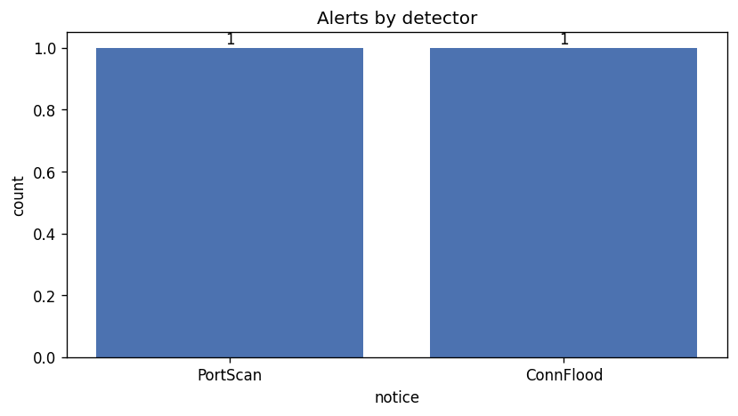

# Results — DRAFT

_Updated: 2026-04-26. Final results in Week 16._

## Datasets

| Source | Type | Use |
|---|---|---|
| `tools/gen_pcap.py` (synthetic) | TCP SYN scan + flood, 270 pkts | Demo: validates PortScan + ConnFlood |
| `artifacts/release/notice.log` (representative) | 5 Zeek notice records | Validates classifier/summarizer end-to-end |
| _planned_: CTU-13 scenario 4 | real botnet capture | Final detection-rate measurement |
| _planned_: 24h benign LAN capture | normal traffic | False-positive baseline |

## Synthetic demo output

```json
{
  "total_alerts": 5,
  "by_note":     { "IDS::PortScan": 2, "IDS::ConnFlood": 1, "IDS::SSHBruteForce": 2 },
  "by_severity": { "medium": 2, "critical": 1, "high": 2 },
  "top_sources": [ {"src": "10.0.0.7", "count": 2}, ... ]
}
```



5 alerts across 3 detectors and 4 source IPs. 10.0.0.7 is noisiest (2 SSH brute-force hits to different destinations) — surfaced via `top_sources`.

**Performance:** Zeek + analyzer wall-clock < 2s on this input. Most analyzer time is matplotlib first-import.

## Open questions for Week 16

1. **False-positive rate** on benign traffic — need a baseline to tune thresholds.
2. **Detection latency** in live-capture mode — currently bounded by the detector window.
3. **Coverage gaps** — no DNS tunneling, beaconing, or lateral-movement detectors yet.

## Reproducing

```sh
make demo
cat artifacts/release/summary.json
```

Drop a real pcap into `pcaps/sample/demo.pcap` and re-run `make analyze` to skip pcap generation.
